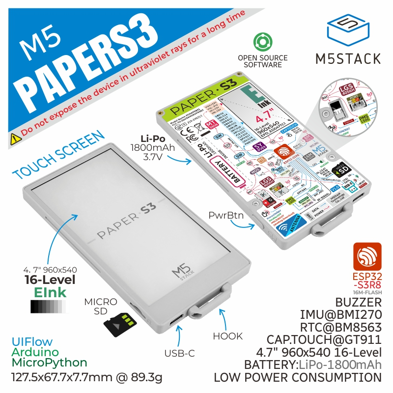

# M5GFX for M5 PaperS3




# The following explanation is for v0.2.6 and earlier. EPDiy is no longer used from v0.2.7.

# 以下の説明は v0.2.6以前のものです。 v0.2.7より EPDiy を使用しなくなりました。

### Notes.
- You need to manually install another library called [EPDiy](https://github.com/vroland/epdiy/).
- As of December 2024, the latest version of EPDiy is not registered in the library manager, so please obtain it from github.
- PSRAM must be enabled at build time.
- PSRAM must be set to Octal SPI (OPI).

### 注意事項  
- 別途 [EPDiy](https://github.com/vroland/epdiy/) というライブラリを手作業で導入する必要があります。  
- 2024/12の時点では EPDiy は最新版がライブラリマネージャに登録されていないため、githubから入手してください。  
- ビルド時にPSRAMを有効にする必要があります。  
- PSRAMは Octal SPI ( OPI ) の設定にする必要があります。  


### for PlatformIO setting.

platformio.ini
```ini
[env:PaperS3]
platform = espressif32
board = esp32-s3-devkitm-1
framework = arduino
board_upload.flash_size = 16MB
board_upload.maximum_size = 16777216
board_build.arduino.memory_type = qio_opi
build_flags = -DBOARD_HAS_PSRAM
lib_deps = epdiy=https://github.com/vroland/epdiy.git
```
