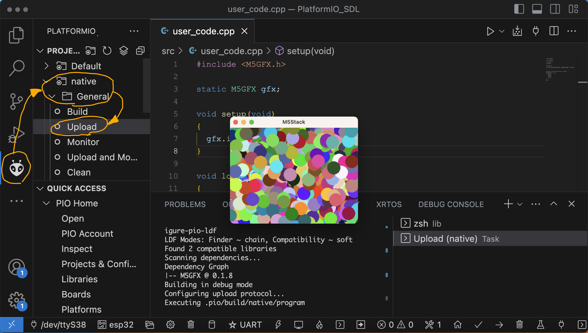
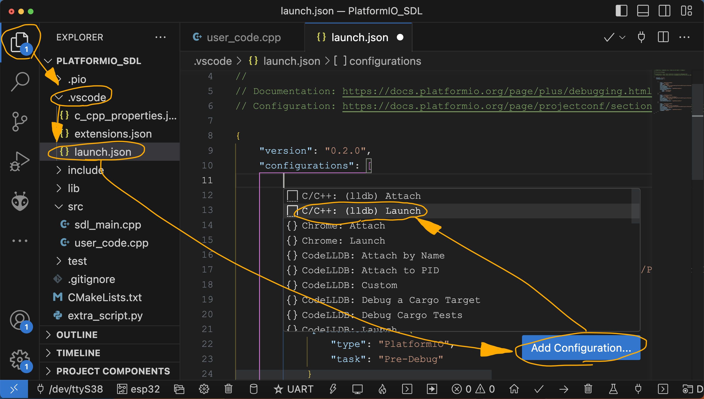
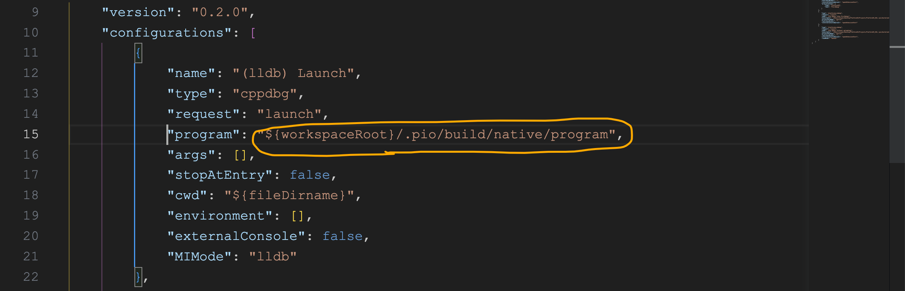

# Steps to run M5GFX on a PC. ( VisualStudioCode + PlatformIO + SDL2 environment. )

## Step 1. install Visual Studio Code and make PlatformIO ready for use.  

https://docs.m5stack.com/ja/quick_start/m5unified/intro_vscode

---

## Step 2. PlatformIO to allow `platform = native` to be built.
https://docs.platformio.org/en/latest/platforms/native.html#installation

#### for Windows
follow the [MSYS2](https://www.msys2.org/) installation guide and add the following paths to the `PATH` system environment variable:
```
C:\msys64\mingw64\bin
C:\msys64\ucrt64\bin
C:\msys64\usr\bin
```

#### for Linux

open the system terminal and run the following commands:
```
sudo apt update
sudo apt install build-essential
```

#### for macOS

open the system terminal and install Xcode Command Line Tools
```
xcode-select --install
```

---

## Step 3. Enable `SDL2` on PlatformIO.

#### for Windows

Go to the [SDL repository on github and obtain the release package (SDL2-devel-x.x.x-mingw.zip).](https://github.com/libsdl-org/SDL/releases) 

Unzip the zip file and copy the following four files to `C:\msys64\mingw64`

 - share
 - bin
 - include
 - lib

#### for Linux

open the system terminal and run the following commands:

```
 sudo apt-get install libsdl2 libsdl2-dev
```

#### for macOS

Install `sdl2` using [Homebrew](https://brew.sh/).
```
 brew install sdl2
```

---

## Step 4. Execute !

Open the `PlatformIO_SDL` folder containing this document in PlatformIO.  

Click on the  icon on the left side of the screen.  
Click `PROJECT TASKS` -> `native` -> `General` -> `Upload`  


※ The window may start up with the window hidden behind. Check the task tray.

---

## Step 5. Use debugger.


#### for macOS

If you want to use the debugger on a mac, lldb is available.



 `EXPLORER` -> `.vscode` -> `launch.json` -> `Add Configuration...` -> `C/C++: (lldb) Launch`


Rewrite the `"program"` : `"${workspaceRoot}/.pio/build/native/program"`

(The `native` part should match the environment name in `PlatformIO`)



Pressing the `F5` key allows debugging execution.

---


